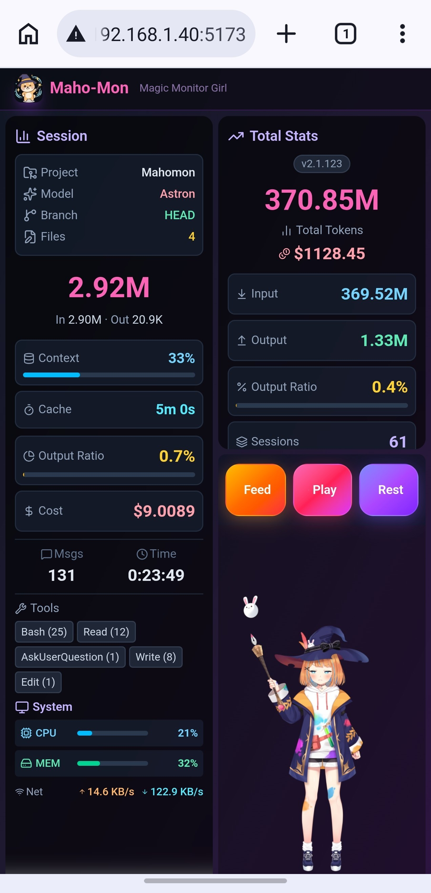
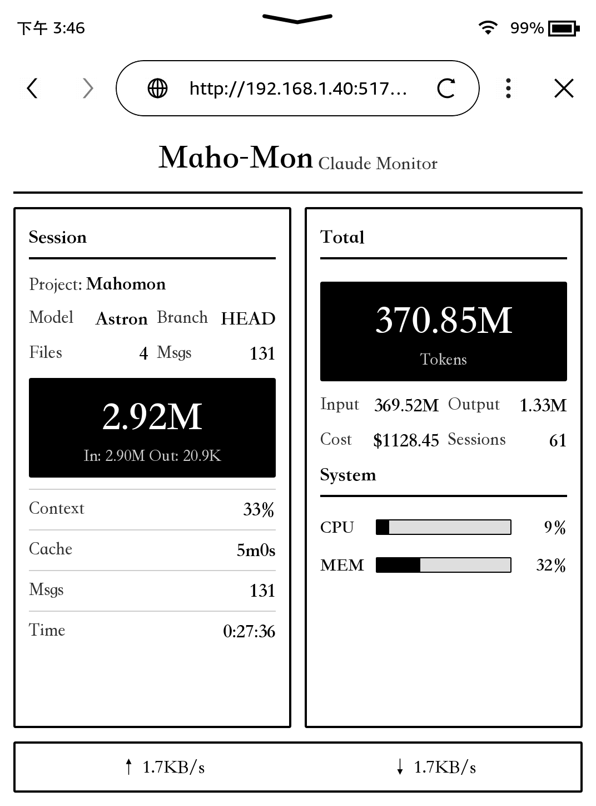

# Maho-Mon 🐱‍🔮

[English](README.md) | [简体中文](README_zh.md) | [日本語](README_ja.md)

<p align="center">
  
</p>

Claude Codeのトークン使用量をリアルタイムで監視するWebベースのアプリ — Live2Dキャラクターとシステム監視を搭載。

## 機能

- **Live2Dキャラクター** — 作業强度に反応する表情を持つアニメーションキャラ
- **リアルタイム監視** — トークン数、入力/出力、コスト、モデル名、コンテキスト使用率
- **セッション追跡** — 現在のセッション統計、編集ファイル、Git ブランチ、使用ツール
- **システム監視** — CPU、メモリ、GPU、ネットワーク速度表示
- **Kindle版** — 電子インク画面向けの最小限UI

## 技術スタック

- **フロントエンド**: React 19 + TypeScript + Vite + Tailwind CSS 4 + Zustand
- **バックエンド**: Node.js + Express
- **Live2D**: pixi-live2d-display + PixiJS 7

## クイックスタート

**前提条件**: Node.js 18+

```bash
# クローンしてインストール
git clone https://github.com/zhaozihui/mahomon.git
cd mahomon
npm install
cd server && npm install && cd ..

# バックエンド起動
cd server && npm run dev

# フロントエンド起動（別ターミナル）
npm run dev
```

### アクセス

| バージョン | URL | 説明 |
|-----------|-----|------|
| メイン | http://localhost:5173 | Live2D付きフルUI |
| Kindle | http://localhost:5173/k.html | 電子インク向け最小UI |

バックエンド API: http://localhost:3001

## Kindle版

Kindle版は電子インク画面向けの最小限UIを提供：

- 電子インク画面に最適化された白黒デザイン
- アニメーションやグラデーションなし
- 5秒間隔で更新

## API エンドポイント

| エンドポイント | 説明 |
|---------------|------|
| `GET /api/usage` | Claude使用データを取得 |
| `GET /api/pet` | ペットステータスを取得 |
| `POST /api/pet` | ペットステータスを更新 |
| `POST /api/pet/interact` | インタラクション実行（餌やり/遊び/休憩） |
| `GET /api/system` | システム監視データを取得 |
| `GET /api/health` | ヘルスチェック |

## プロジェクト構成

```
mahomon/
├── src/                    # フロントエンドソース
│   ├── components/         # React コンポーネント
│   │   ├── Live2DCanvas.tsx
│   │   ├── SessionBubble.tsx
│   │   ├── StatsPanel.tsx
│   │   └── SystemMonitor.tsx
│   ├── pages/kindle/       # Kindle版
│   ├── stores/             # Zustand stores
│   ├── lib/                # コアロジック
│   └── types/              # TypeScript 型定義
├── server/                 # バックエンドソース
│   ├── routes/             # API ルート
│   ├── lib/                # バックエンドロジック
│   │   ├── claudeMonitor.ts
│   │   └── petStorage.ts
│   └── types/
└── public/
    ├── k.html              # Kindle HTML（独立）
    └── assets/live2d/      # Live2D モデルファイル
```

## データソース

以下から Claude Code 使用データを読み込み：

- `~/.claude/stats-cache.json` — 累積トークン統計
- `~/.claude/sessions/*.json` — セッション活動ログ
- `~/.claude/projects/*/*.jsonl` — プロジェクトセッションデータ

## スクリーンショット

### モバイル版

<p align="center">
  
</p>

### Kindle版

<p align="center">
  
</p>

## ライセンス

MIT